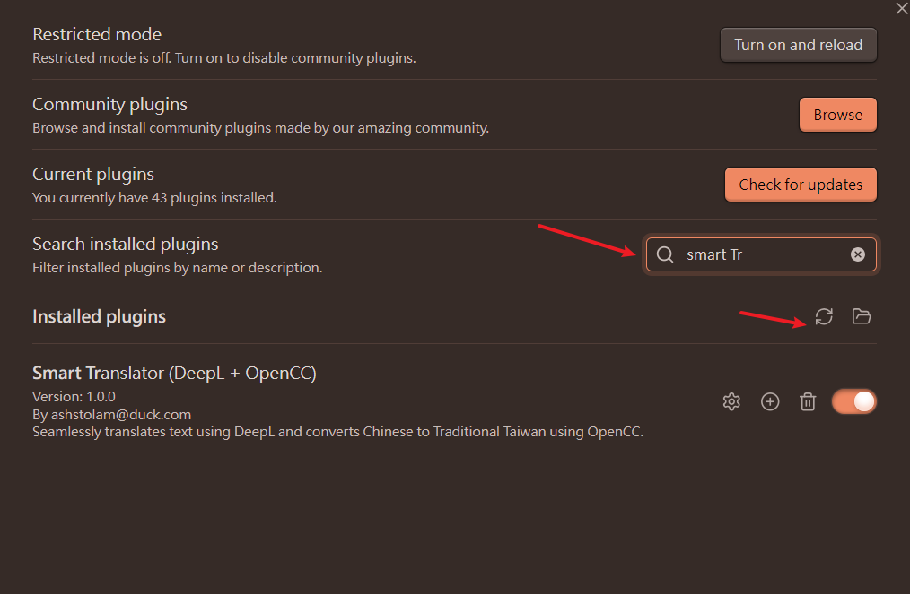
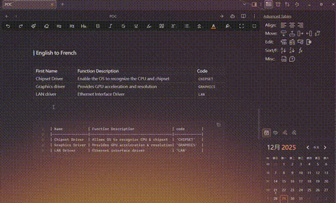
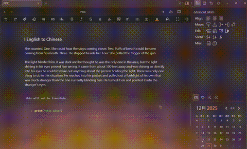
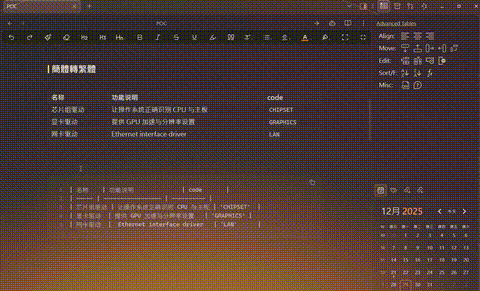
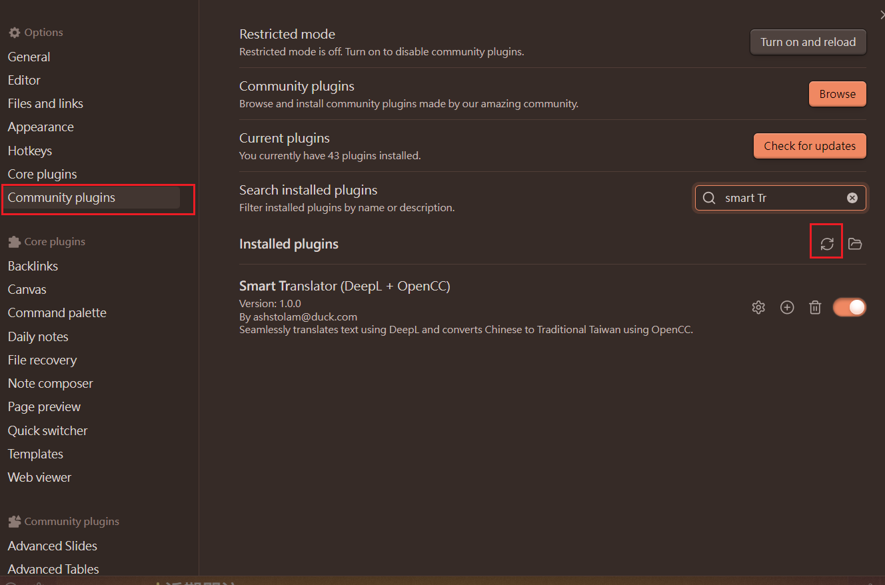

# Smart Translator for Obsidian

Intelligent translation plugin for Obsidian using DeepL API with automatic content protection.

As a prompt engineer, I always copy paste csdn stuff, for quick localization, I vibed this plugin

[繁體中文](#繁體中文說明) | [English](#english-version)

---
## INSTALLATION
1. Download `smart-translator.zip` --> extract to `<obsidian_vault>\.obsidian\plugins` 
2. clone -> `npm install` -> (optional) optimize/do some vibe coding -> `npm run build` -> copy the whole folder to `<obsidian_vault>\.obsidian\plugins` 


---

## English Version

### Main Features

#### Supported Languages

- **zh-TW**: Traditional Chinese
- **zh-CN**: Simplified Chinese
- **EN**: English
- **FR**: French
- **DE**: German
- **JA**: Japanese
- need more? add them yourself!

#### Fully Translated & replace (Right Click/Command Line)
|EN -> FR|EN -> zh-CN|
|---|---|
|||

|EN -> FR (with command)|zh-CN -> zh-TW (with command)|
|---|---|
|||

- **DeepL Translation**: Professional translation powered by DeepL API
- **Smart Protection**: Automatically preserves code blocks, inline code, tables, links, and Obsidian syntax
- **Table Support**: Cell-by-cell translation that perfectly preserves table structure
- **OpenCC for Chinese**: Offline Traditional/Simplified Chinese conversion (no API needed)
- **Multiple Languages**: Traditional Chinese, Simplified Chinese, English, French, German, Japanese
- **Easy to Use**: Right-click menu and command palette integration

### Quick Setup

1. **Get DeepL API Key**
   - Visit [deepl.com/pro-api](https://www.deepl.com/pro-api)
   - Sign up for free or pro account
   - Copy your API key

2. **Configure Plugin**
   - Open Obsidian Settings → Smart Translator
   - Paste your API key
   - Select API type (Free or Pro)
   - Click "Test Connection" to verify
   - Choose default target language
   

3. **Start Translating**
   - Select text → Right-click → Translate
   - Or use Command Palette (`Ctrl+P`) → Search "Translate"

### Usage

**Right-Click Menu**: Select text → Right-click → Choose target language

**Command Palette**:
- `Translate: Full Page → [Language]` - Translate entire note
- `Translate: Section → [Language]` - Translate selected text

**Traditional Chinese (Offline)**:
- Uses OpenCC - No DeepL API needed
- Perfect for Simplified ↔ Traditional Chinese conversion

### What Gets Protected (will not being auto translated)

✅ Code blocks (` ```...``` `)
✅ Inline code (`` `...` ``)
✅ Wikilinks (`[[note]]`)
✅ Embeds (`![[image]]`)
✅ Tags (`#tag`)
✅ Links (`[text](url)`)


### Example

**Input:**
```markdown
| Feature | Status |
|---------|--------|
| Login | Complete |

Check the API at `https://api.example.com`
```

**Output (Traditional Chinese):**
```markdown
| 功能 | 狀態 |
|---------|--------|
| 登入 | 已完成 |

檢查位於 `https://api.example.com` 的 API
```

---

## 繁體中文說明

### 主要功能

#### 支援語言

- **ZH-HANT**：繁體中文（台灣）
- **ZH**：簡體中文
- **EN**：英文
- **FR**：法文
- **DE**：德文
- **JA**：日文
- 其他語言支援? 自己加上去ovo

#### 即時翻譯替換(支持右鍵/命令行)
|英文 -> 法文|英文 -> 繁體中文|
|---|---|
|||

|英文 -> 法文 (命令行)|簡體中文-> 繁體中文 (命令行)|
|---|---|
|||

- **DeepL 翻譯**：使用 DeepL API 提供專業翻譯
- **智慧保護**：自動保留程式碼區塊、行內程式碼、表格、連結和 Obsidian 語法
- **表格支援**：逐格翻譯，完美保留表格結構 --> 拜託給個星星吧 這個有夠麻煩
- **OpenCC 中文轉換**：離線簡繁轉換（無需 API）
- **多語言支援**：繁體中文、簡體中文、英文、法文、德文、日文
- **簡單易用**：右鍵選單與命令面板整合

### 快速設定

1. **取得 DeepL API 金鑰**
   - 訪問 [deepl.com/pro-api](https://www.deepl.com/pro-api)
   - 註冊免費或專業版帳號
   - 複製您的 API 金鑰

2. **配置外掛**
   - 開啟 Obsidian 設定 → Smart Translator
   - 貼上 API 金鑰
   - 選擇 API 類型（免費或專業版）
   - 點擊「測試連線」驗證
   - 選擇預設目標語言

3. **開始翻譯**
   - 選取文字 → 右鍵 → 翻譯
   - 或使用命令面板（`Ctrl+P`）→ 搜尋「Translate」

   


### 使用方式

**右鍵選單**：選取文字 → 右鍵 → 選擇目標語言

**命令面板**：
- `Translate: Full Page → [語言]` - 翻譯整個筆記
- `Translate: Section → [語言]` - 翻譯選取文字

**繁體中文（離線）**：
- 使用 OpenCC - 無需 DeepL API
- 適合簡體 ↔ 繁體中文轉換

### 自動保護內容

✅ 程式碼區塊（` ```...``` `）
✅ 行內程式碼（`` `...` ``）
✅ 表格（結構保留，內容翻譯）
✅ Wikilinks（`[[筆記]]`）
✅ 嵌入（`![[圖片]]`）
✅ 標籤（`#標籤`）
✅ 連結（`[文字](url)`）


### 範例

**輸入：**
```markdown
| Feature | Status |
|---------|--------|
| Login | Complete |

Check the API at `https://api.example.com`
```

**輸出（繁體中文）：**
```markdown
| 功能 | 狀態 |
|---------|--------|
| 登入 | 已完成 |

檢查位於 `https://api.example.com` 的 API
```

---

## License

MIT License

## Credits

- [DeepL API](https://www.deepl.com/) - Translation service
- [OpenCC](https://github.com/BYVoid/OpenCC) - Chinese character conversion
